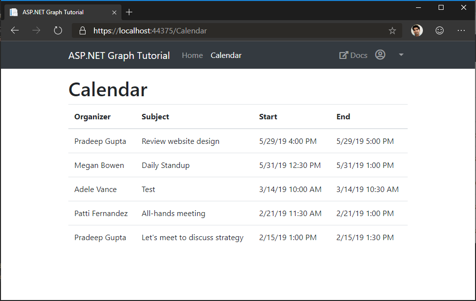

<!-- markdownlint-disable MD002 MD041 -->

В этой демонстрации вы добавите Microsoft Graph в приложение. Для этого приложения вы будете использовать клиентскую [библиотеку Microsoft Graph для .NET](https://github.com/microsoftgraph/msgraph-sdk-dotnet) , чтобы совершать вызовы в Microsoft Graph.

## <a name="get-calendar-events-from-outlook"></a>Получение событий календаря из Outlook

Начните с расширения `GraphHelper` класса, созданного в последнем модуле.

1. Добавьте приведенные `using` ниже операторы в начало `Helpers/GraphHelper.cs` файла.

    ```cs
    using graph_tutorial.TokenStorage;
    using Microsoft.Identity.Client;
    using System.Collections.Generic;
    using System.Configuration;
    using System.Linq;
    using System.Security.Claims;
    using System.Web;
    ```

1. Добавьте в `GraphHelper` класс приведенный ниже код.

    ```cs
    // Load configuration settings from PrivateSettings.config
    private static string appId = ConfigurationManager.AppSettings["ida:AppId"];
    private static string appSecret = ConfigurationManager.AppSettings["ida:AppSecret"];
    private static string redirectUri = ConfigurationManager.AppSettings["ida:RedirectUri"];
    private static string graphScopes = ConfigurationManager.AppSettings["ida:AppScopes"];

    public static async Task<IEnumerable<Event>> GetEventsAsync()
    {
        var graphClient = GetAuthenticatedClient();

        var events = await graphClient.Me.Events.Request()
            .Select("subject,organizer,start,end")
            .OrderBy("createdDateTime DESC")
            .GetAsync();

        return events.CurrentPage;
    }

    private static GraphServiceClient GetAuthenticatedClient()
    {
        return new GraphServiceClient(
            new DelegateAuthenticationProvider(
                async (requestMessage) =>
                {
                    var idClient = ConfidentialClientApplicationBuilder.Create(appId)
                        .WithRedirectUri(redirectUri)
                        .WithClientSecret(appSecret)
                        .Build();

                    var tokenStore = new SessionTokenStore(idClient.UserTokenCache,
                            HttpContext.Current, ClaimsPrincipal.Current);

                    var accounts = await idClient.GetAccountsAsync();

                    // By calling this here, the token can be refreshed
                    // if it's expired right before the Graph call is made
                    var scopes = graphScopes.Split(' ');
                    var result = await idClient.AcquireTokenSilent(scopes, accounts.FirstOrDefault())
                        .ExecuteAsync();

                    requestMessage.Headers.Authorization =
                        new AuthenticationHeaderValue("Bearer", result.AccessToken);
                }));
    }
    ```

    > [!NOTE]
    > Рассмотрите, что делает этот код.
    >
    > - `GetAuthenticatedClient` Функция инициализирует объект `GraphServiceClient` с помощью поставщика проверки подлинности, который вызывает `AcquireTokenSilent`.
    > - В `GetEventsAsync` функции:
    >   - URL-адрес, который будет вызываться — это `/v1.0/me/events`.
    >   - `Select` Функция ограничит поля, возвращаемые для каждого события, только теми, которые будут реально использоваться в представлении.
    >   - `OrderBy` Функция сортирует результаты по дате и времени создания, начиная с самого последнего элемента.

1. Создайте контроллер для представлений календаря. Щелкните правой кнопкой мыши **** папку Controllers в обозревателе решений и выберите **Добавить контроллер >..**.. Выберите **контроллер MVC 5 — пустой** и нажмите кнопку **Добавить**. Присвойте имя `CalendarController` контроллеру и нажмите кнопку **Добавить**. Замените все содержимое нового файла приведенным ниже кодом.

    ```cs
    using graph_tutorial.Helpers;
    using System;
    using System.Threading.Tasks;
    using System.Web.Mvc;

    namespace graph_tutorial.Controllers
    {
        public class CalendarController : BaseController
        {
            // GET: Calendar
            [Authorize]
            public async Task<ActionResult> Index()
            {
                var events = await GraphHelper.GetEventsAsync();

                // Change start and end dates from UTC to local time
                foreach (var ev in events)
                {
                    ev.Start.DateTime = DateTime.Parse(ev.Start.DateTime).ToLocalTime().ToString();
                    ev.Start.TimeZone = TimeZoneInfo.Local.Id;
                    ev.End.DateTime = DateTime.Parse(ev.End.DateTime).ToLocalTime().ToString();
                    ev.End.TimeZone = TimeZoneInfo.Local.Id;
                }

                return Json(events, JsonRequestBehavior.AllowGet);
            }
        }
    }
    ```

1. Запустите приложение и войдите в систему, а затем щелкните ссылку **Календарь** на панели навигации. Если все работает, вы должны увидеть дамп событий JSON в календаре пользователя.

## <a name="display-the-results"></a>Отображение результатов

Теперь вы можете добавить представление для отображения результатов более удобным для пользователя способом.

1. В обозревателе решений щелкните правой кнопкой мыши папку **views/Calendar** и выберите команду **Добавить > представление..**.. Назовите представление `Index` и нажмите кнопку **Добавить**. Замените все содержимое нового файла приведенным ниже кодом.

    ```html
    @model IEnumerable<Microsoft.Graph.Event>

    @{
        ViewBag.Current = "Calendar";
    }

    <h1>Calendar</h1>
    <table class="table">
        <thead>
            <tr>
                <th scope="col">Organizer</th>
                <th scope="col">Subject</th>
                <th scope="col">Start</th>
                <th scope="col">End</th>
            </tr>
        </thead>
        <tbody>
            @foreach (var item in Model)
            {
                <tr>
                    <td>@item.Organizer.EmailAddress.Name</td>
                    <td>@item.Subject</td>
                    <td>@Convert.ToDateTime(item.Start.DateTime).ToString("M/d/yy h:mm tt")</td>
                    <td>@Convert.ToDateTime(item.End.DateTime).ToString("M/d/yy h:mm tt")</td>
                </tr>
            }
        </tbody>
    </table>
    ```

    Это приведет к перебору коллекции событий и добавлению строки таблицы для каждой из них.

1. Удалите `return Json(events, JsonRequestBehavior.AllowGet);` строку из `Index` функции `Controllers/CalendarController.cs`и замените ее на приведенный ниже код.

    ```cs
    return View(events);
    ```

1. Запустите приложение и войдите в систему, а затем щелкните ссылку " **Календарь** ". Теперь приложение должно отображать таблицу событий.

    
